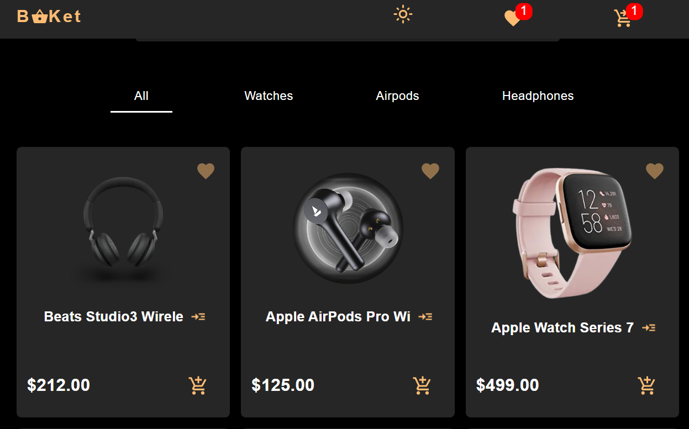
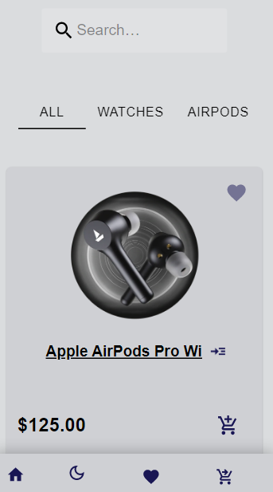
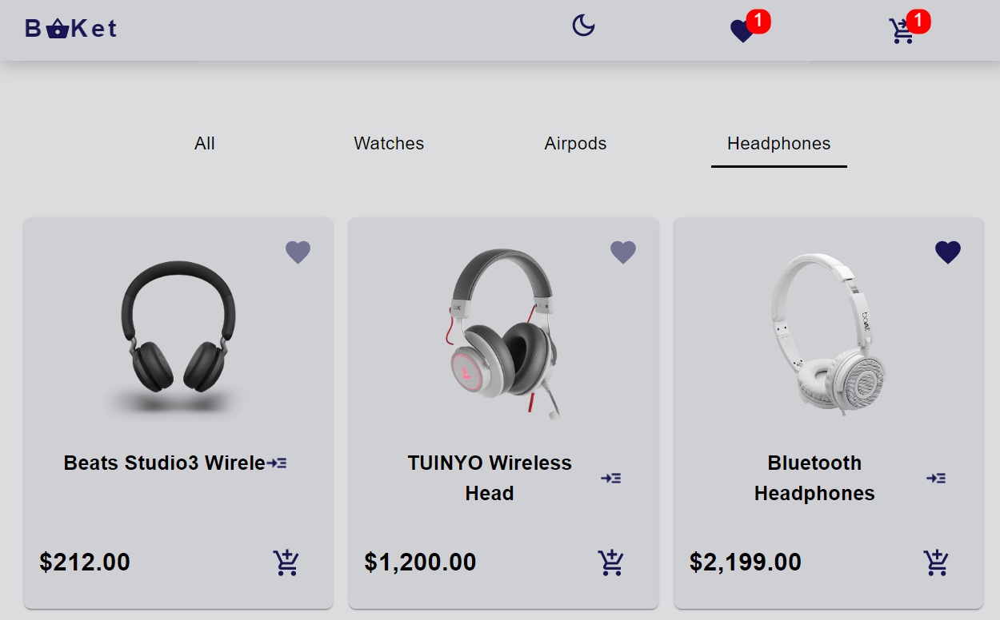
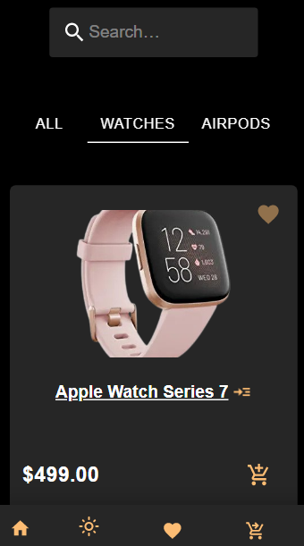

# Project Name
	Buket Ecommerce App 🛒

# Demo link
 Preview App Demo [Buket_Ecommerce_App](https://buket.netlify.app)

## Table of Content: 📑

-	- [About The App: 📚](#about-the-app-)
	- [Screenshots: 📷](#screenshots-)
	- [Technologies & Languages:  ☕️ 🐍 ⚛️🧪📲](#technologies--languages--️--️)
	- [Approach: 🚶](#approach-)
	- [Some challenges when i code this app:](#some-challenges-when-i-code-this-app)
		- [1- localStorage:](#1--localstorage)
		- [2- Custom hook:](#2--custom-hook)
	- [Status: 📶](#status-)
	- [Credits Contributors images: 📝](#credits-contributors-images-)
	- [Fix issues or add some features:  💻](#fix-issues-or-add-some-features--)
	- [License ©️](#license-️)

## About The App: 📚

**Buket Ecommerce App** :  
Is a fully functional Ecommerce website with search, categories, discover products,  
cart [add, remove, increase || decrease QTY, checkout ],   
save your favorite products to wishlist page, change between light & dark theme .

## Screenshots: 📷

|  Desktop   | Mobile  |
| ------------- | ---------- |
|    |   |
|    |     |

.

## Technologies & Languages:  ☕️ 🐍 ⚛️🧪📲
- html
- css
- react
- react router
- commerce js
- material ui
- material icons
- stripe

## Approach: 🚶

- I want to build fully functional Ecommerce website with the help of commerce.js that handle the checkout process  
- That's what let me focus on building the ui
- I tried to implement most of react features like:
> react-router | nested-router | react hooks | react-context | use-location | and more ...
	

## Credits Contributors images: 📝

>

## Fix issues or add some features:  💻
	- download or clone the repository
	- run npm install
	- npm start	
	- start fix issues or add some features
	- write clear commits describe all your changes
	- save all your changes 
	- pull your changes

## License ©️

All Copyright Save To   [**Ali Sabry**](https://www.linkedin.com/in/ali-sabry/)
